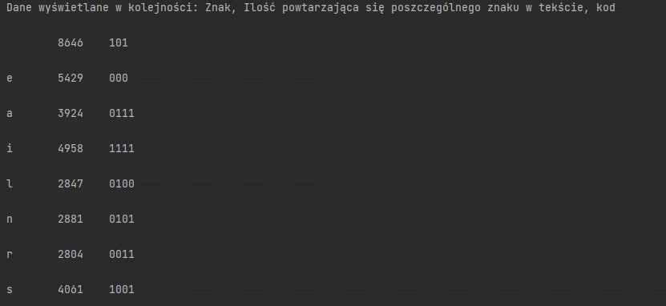

<h2 style="text-align: center;"><strong>Algorytmy i Struktura Danych - Projekt II</strong></h2>

 
<h3><strong>Opis zadania:</strong></h3>

 

Program powinien:

1. wczytywać tekst z pliku

2. zapisywać skompresowany tekst do pliku

 dodatkowo:

3. plik wyjściowy powinien zawierać jawnie podany "słownik" oraz binarnie zapisany skompresowany tekst

4. w rozwiązaniu należy użyć własnej implementacji kolejki priorytetowej (wymagane jest uzycie kopcow)

5. użyj takiego tekstu, aby plik skompresowany zajmował mniej miejsca

6. do rozwiązania dołącz dwa pliki (przed i po kompresji)

7. projekt należy zaprezentować aby otrzymać punkty.

 

 Na ten moment zapisane są ilości powtarzające się konkretnych znaków oraz kod binarny 

<footer> Filip Bianga s19329 </footer>